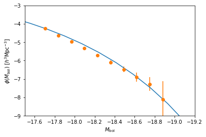

.. module:: emcee

**Note:** This tutorial was generated from an IPython notebook that can be
downloaded `here <../../_static/notebooks/scampy_quickstart.ipynb>`_.

.. _scampy_quickstart:

Quickstart
==========

In this tutorial we show how to obtain a mock-catalogue using
``scampy``.

First, we will load a DM halo/sub-halo hierarchy obtained with the
SUBFIND algorithm applied on a :math:`z = 0` GADGET snapshot. Then, we
will 1. populate the catalogue with galaxies 2. associate to each galaxy
a luminosity

First of all, we populate the namespaces from numpy and matplotlib (it
would be enough to state ``import numpy as np`` for working, this is
mostly useful for plotting)

.. code:: python

    # import numpy as np
    %pylab inline

.. parsed-literal::

    Populating the interactive namespace from numpy and matplotlib

Now, we import the ``catalogue`` module from ``scampy``:

.. code:: python

    from scampy import catalogue

We now build an object of type catalogue and read the halo/sub-halo
hierarchy from the binary output of the SUBFIND algorithm.

**Note** that, tipically, these outputs are given as a set of files with
a common base-name, e.g. ``subhalo_tab.0`` for the first file in the
set. Here we just need to provide the common name of all the files, i.e.
``subhalo_tab``.

.. code:: python

    cat = catalogue.catalogue()
    cat.read_hierarchy_from_gadget( "input/subhalo_tab" )

The catalogue we provide in the ``input`` directory has been obtained
for a simulation box with side-lenght
:math:`L_\text{box} = 512\ \text{Mpc}/h`, thus we can define a
``volume`` variable that we will use later:

.. code:: python

    volume = 512**3

1. Populate catalogue
---------------------

We will now populate the above catalogue with a 4-parameters HOD model:
:raw-latex:`\begin{align}
N_\text{cen} =& \dfrac{1}{2} \biggl[1 + \text{erf}\biggl(\dfrac{\log M_h - \log A_\text{min}}{\sigma_{\log A}}\biggr)\biggr]\\
N_\text{sat} =& \biggl(\dfrac{M_h}{A_\text{sat}}\biggr)^\alpha_\text{sat}
\end{align}` with parameters: :math:`A_\text{min} = 10^{14}\ M_\odot/h`,
:math:`\sigma_{\log A} = 0.5`, :math:`A_\text{sat} = 10^{15}\ M_\odot/h`
and :math:`\alpha_\text{sat} = 1`.

To do so, we have first to build an object of type ``occupation_p`` with
given parameters:

.. code:: python

    from scampy import occupation_p
    ocp = occupation_p.tinker10_p( Amin = 1.e+14, siglogA = 0.5, Asat=1.e+15, alpsat=1. )

Then, we can call the ``populate`` function of the class catalogue,
which returns a populated catalogue and the number of hosted galaxies:

.. code:: python

    gxy_cat, Ng = cat.populate( ocp )

2. Associate luminosity
-----------------------

In order to run the SHAM algorithm, we import the ``abundance_matching``
module of ``scampy``

.. code:: python

    from scampy import abundance_matching

First of all, we need the probability distribution of the observable we
want to add to the mock galaxies.

Le us define a Schechter luminosity function:
:raw-latex:`\begin{equation}
\phi( M ) = 0.4 \ln(10) \phi^* 10^{0.4 (\alpha + 1) (M - M^* )} \exp\bigl( -10^{0.4 (M - M^* )}\bigr)
\end{equation}`

.. code:: python

    def schechter ( mag ) :
        alpha = -1.07
        norm = 1.6e-2
        mstar = -19.7 + 5. * np.log10( 5. )
        lum = - 0.4 * ( mag - mstar )
        return 0.4 * np.log( 10 ) * norm * 10**( - 0.07 * lum ) * np.exp( - 10**lum )

The routine that implements the SHAM algorithm operates on arrays of
``galaxy`` type objects, instead of on objects of type ``catalogue``.

Such arrays can be extracted from a populated catalogue either directly,
by calling the ``populate()`` function with the argument
``extract = True``:

.. code:: python

   galaxies = cat.populate( ocp, extract = True )

or by calling the ``extract_galaxies()`` function of the ``catalogue``
module. This function takes 2 arguments: - an array of ``host_halo``
type objects (i.e. the ``content`` of a catalogue; - the number of
galaxies found by the ``populate`` algorithm.

.. code:: python

    galaxies = catalogue.extract_galaxies( gxy_cat.content, Ng )

At this point we have everything we need for running the SHAM algorithm.
It is implemented in the ``abundance_matching()`` function of the
``abundance_matching`` module. This function takes several argumens, we
refer the reader to the documentation for a detailed description.

The positional arguments are: - the array of ``galaxy`` type objects
(``galaxies``); - the probability distribution of the observable
property we want to match (it must depend only on one-variable). Here we
are also setting the following keyword arguments: - ``minL`` and
``maxL``, the limits of the free-variable in our probability
distribution; - ``nbinM``, the number of bins we want to divide the
mass-space; - ``factM``, the constant factor to multiply the
mass-distribution (since we want a volume density, here we are passing
``1/volume``.

.. code:: python

    galaxies = abundance_matching.abundance_matching( galaxies, schechter, 
                                                      minL = -20, maxL = -10,
                                                      nbinM = 20, factM = 1. / volume ) 

.. parsed-literal::

    /opt/miniconda3/envs/learn/lib/python3.6/site-packages/ipykernel_launcher.py:6: RuntimeWarning: overflow encountered in double_scalars
      

… and that’s all folks!

The ``galaxies`` array now contains all the mock-galaxies of our
catalogue.

Analysis
--------

.. code:: python

    luminosities = np.array( [ gxy.luminosity for gxy in galaxies ] )
    mag_mes = linspace( np.min( luminosities ), np.max( luminosities ), 10 )
    phi_mes, phi_mes_er = abundance_matching.cumulative_counts( -1 * luminosities, -1 * mag_mes, 1. / volume )

.. code:: python

    plt.xlabel( '$M_\mathrm{bol}$' )
    plt.ylabel( '$\phi( M_\mathrm{bol} )\ [h^3 \mathrm{Mpc}^{-3}]$' )
    
    plt.xlim( [ -17.5, -19.2 ] )
    plt.ylim( [ -9, -3 ] )
    
    size = 30
    MM = linspace( -21, -16., size )
    
    plot( MM, np.log10( abundance_matching.cumulative_from_differential( schechter, MM, 1. ) ) )
    # plot( mag_mes, np.log10( phi_mes ) )
    errorbar( mag_mes, np.log10( phi_mes ), 
              yerr = phi_mes_er / phi_mes, fmt = 'o' )

.. parsed-literal::

    /opt/miniconda3/envs/learn/lib/python3.6/site-packages/ipykernel_launcher.py:6: RuntimeWarning: overflow encountered in double_scalars
      

.. parsed-literal::

    <ErrorbarContainer object of 3 artists>

